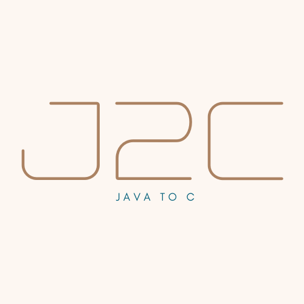

# COMP 430: Language Design and Compilers

Language Name: <b>J2C</b>

## Goal

Implement a compiler for the designed language, complete with:

<li>A parser</li>
<li>A typechecker / static semantic analyzer</li>
<li>A code generator</li>

## Authors
<pre>
Ibtehaz Utsay
Ziaur Chowdhury
Noah Reidinger
Ryan Nieto
Leo Babakhanian
Vardges Harutyunyan
</pre>

## Documentation

Link to Initial Proposal: (<https://docs.google.com/document/d/1mQWRqwIdn_nY9M3pWh7nB8k_Ht-t0xxur-jjfsBvdB4/edit>)

Target Language: C

<h3>Abstract Syntax:</h3>
var is a variable
classname is the name of a class
methodname is the name of a method
str is a string
i is an integer

### Original Grammer (Left-recursive, no operator precedence)
```
type:: = int | bool | void | Built-in types
    classname; includes Object and String
op:: = * | / | + | - | % | < | > | == | != Arithmetic operations
exp:: = var | str | i | Variables, strings, and integers are expressions
this | Refers to my instance
exp op exp | Arithmetic operations
new classname(exp*) | Creates a new instance of a class
exp. methodname(exp*) | Calls a method
(type)exp | Casts an expression as a type/Runtime exception for improper casting
vardec:: = type var | Variable declaration
stmt:: = vardec = exp; | Variable declaration
var = exp; | Assignment
while (exp) stmt | while loops
break; | break
{ stmt* } | block
if (exp) stmt else stmt | if/else
return exp; | return an expression
return; | return Void
println(exp) | Prints something to the terminal
exp. methodname(exp*) | Calls a method
access ::= public | private | protected
methoddef ::= access type methodname(vardec*) stmt vardecs are comma-separated 
instancedec ::= access vardec; instance variable declaration classdef ::= class classname extends classname {
instancedec* 
constructor(vardec*) stmt vardecs are comma-separated 
methoddef*
} 
program ::= classdef* exp exp is the entry point

```
### New Grammar (Not left-recursive and handles operator precedence)
```
var is a variable
classname is the name of a class
methodname is the name of a method
str is a string
i is an integer
type:: = int | bool | void | str | classname
primary_exp ::= x | i | `(` exp `)` | x.methodname(exp*)
dot_exp ::= additive_exp (`.` additive_exp)*
additive_op ::= + | -
additive_exp ::= primary_exp (additive_op primary_exp)*
less_than_exp ::= dot_exp (`<` dot_exp)*
equals_exp ::= less_than_exp (`==` less_than_exp)*
exp ::= equals_exp
new classname(exp*) | Creates a new instance of a class
exp. methodname(exp*) | Calls a method
(type)exp | Casts an expression as a type/Runtime exception for improper casting
vardec:: = type var | Variable declaration
stmt:: = vardec = exp; | Variable declaration
var = exp; | Assignment
while (exp) stmt | while loops
break; | break
{ stmt* } | block
if (exp) stmt else stmt | if/else
return exp; | return an expression
return; | return Void
println(exp) | Prints something to the terminal
exp. methodname(exp*) | Calls a method
access ::= public | private | protected
methoddef ::= access type methodname(vardec*) stmt vardecs are comma-separated 
instancedec ::= access vardec; instance variable declaration classdef ::= class classname extends classname {
instancedec* 
constructor(vardec*) stmt vardecs are comma-separated 
methoddef*
```

# Features

Computation Abstraction Non-Trivial Feature: Class based inheritance + Methods

Non-Trivial Feature #2: Subtyping

Non-Trivial Feature #3: Type Casting

Work Planned for Custom Component: Access Modifiers

# Testing

To run the tests:

```
mvn compile
mvn test
```
To view reports: 
```
mvn jacoco: report
open target/site/jacoco/index.html
```
